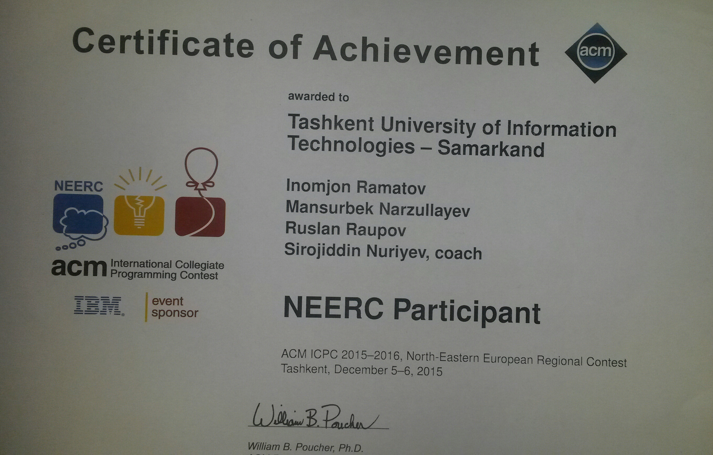

### Inomjon Ramatov (March 23, 2019)

Inomjon Ramatov, Co-founder and Lead A.I. engineer at [Tass-Vision](https://tass-vision.uz/) Co., Ltd, and this is a bit of copy about him.

 When he was learning counting numbers, he fell in love with math. He was the best at physics in the Samarkand province among the peers during his middle and high school period. You can ask why not at math? There was Zarif, one of his good friends. He gave chance to his friend, using this opportunity Zarif won silver medal in International Mathematical Olympics. Actually, it is not the real reason for choosing physics, he chose it because in his village power failure was very often and he wanted and dreamed invent “infinite energy source”. Unfortunately, after coming to study in high school in Samarkand city, he forgot about those dreams, because there were always electricity.  He used to teach math and physics during his high school period for juniors, and even for senior students of his high school.  Most of those students entered to study in high-level universities of Russia and Uzbekistan.  Native Uzbek, but he can speak simple Chinese, Russian, English, Uyghur languages, can write and read in Arabic. He can speak Tajik, Kazakh, Kirghiz and Turkish languages, too but he prefer to keep it secret. In 2012, he graduated from high school with honors and applied for 3 universities at once, they are Tyumen State Oil and Gas University (in Russia, he passed exam and won scholarship), Gubkin Oil and Gas University Tashkent branch (in Uzbekistan, he failed exam) and  Tashkent University of Information Technology Samarkand branch(in Uzbekistan, he passed exam and won scholarship). And he chose study in Uzbekistan, because his friends scared him by saying “Russians are very rude and don’t respect foreigners ”, (it might be funny reason, but he likes being respectful all the time, that’s why he is in China now, Chinese people respect and like foreigners). However, he studied in international group of university, main difference between international and national group was teaching language, in international group teaching language was Russian language and there were many kind of nationality students such as Koreans, Tajiks, Tatars, Iranians and sure Uzbeks. While in the university,   he participated 2 times in ACM International Collegiate Programming Contest, NEERC, but never passed for final because the "weather condition" was not convenient during the competition day for him and his team and they failed to solve some problems of contest (at least it is his opinion). By the way, ACM International Collegiate Programming Contest is known as the ICPC, an annual multi-tiered competitive programming competition among the universities of the world. NEERC, the Northern Eurasia Finals, is the contest for Northern Eurasia teams with best teams qualifying for World Finals of ICPC. (Sounds amazing, right?! and it is!). 

He is a fan of Bruce Lee, Jackie Chan and Lee Byung-hun.  If someone makes complement by saying "you look like Lee Byung-hun or Bruce Lee", you can see his all teeth because of his happiness.  When you ask him "what's your hobby Inomjon?' probably he replies "reading books"([here](/blog/books/) you can find his lovely ten books).

 Actually, his hobby is playing guitar. Ok, Ok, I know, it is not true, he cannot play guitar at all! However, he is good at sleeping; he can do it with closed eyes.   He can sing a song and dance (Note* only if only he is drunk!). His favorite thing is talking with his parents on the phone for hours. The reason,  he is living far from his family almost for ten years because of studying.  He loves small babies; he thinks they smell with smell of heaven. He dislikes the word "No" and reject others.  As Fabiao said (his Brazilian friend), he always replies with "yeah, yeah". Are you still reading? Really? it seems he is a good writer, too. He never thought he would write this kind of bio about himself someday. He is inspired by reading Zohid’s amazingly interesting biography, he could share it with you but it is written in Uzbek language so you might not understand.

 While on subject, Zohid works as a project manager at [OOO Agata Impex](http://agatagroup.uz/), he is a salesman, writer, generous, creative, conversationalist person, but most import, he is Inomjon's one of the best friends and source of motivation.   
 

 As you know while reading this bio, Inomjon also likes boasting himself. Anyway, he is a quick learner, he was less than zero (as Mr. Zhan Wei laoshi said) within a year, he became an AI engineer because of support and guidance, help of many Chinese friends in his office and of course working and studying hard on himself. One of his best student Liu HaiDong is Inomjon’s good friend; he is outgoing and helpful boy. In Inomjon’s opinion, he will become a good manager of big IT Company in the future. 

Whew, it is difficult writing about myself being third person, hahaha. As Bruce lee said, “Honestly expressing yourself, not lying oneself, it is very difficult to do, my friend" :smile: . I wrote this for fun, some of stories are over boasted, but all based on real life of me. I appreciate all your opinions about it. Thanks for your time and passion!
Sincerely Inomjon.

Certificate of achievement:

