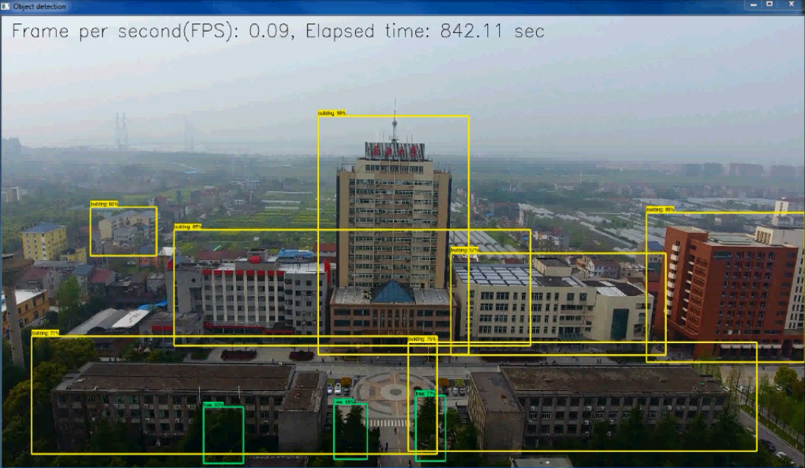
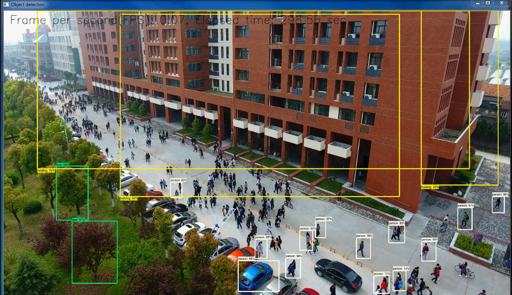
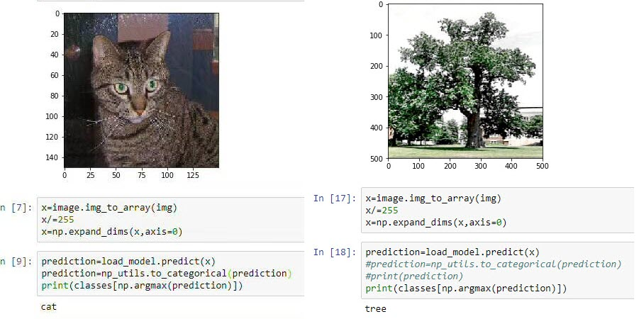
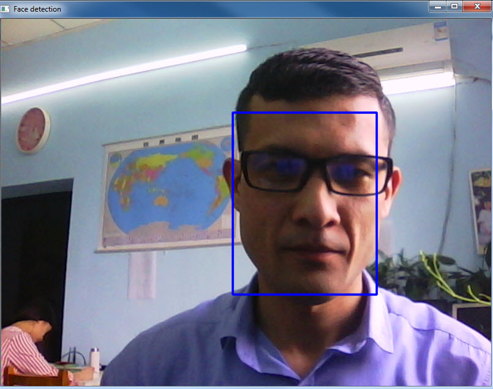
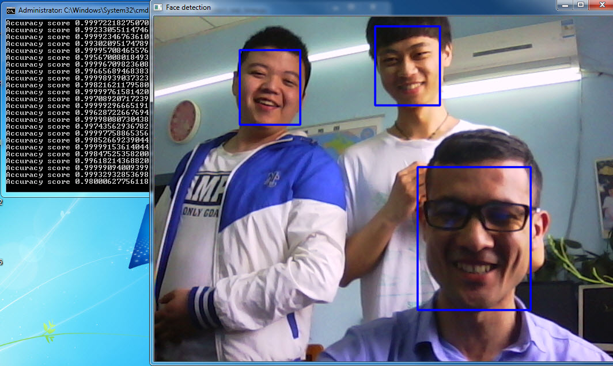
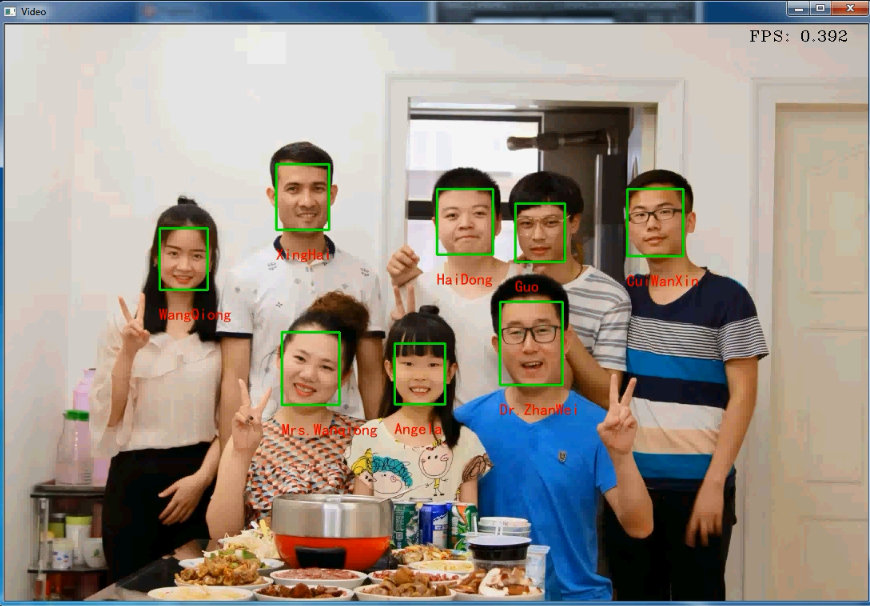
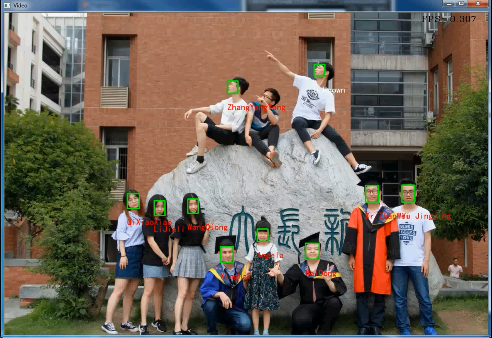
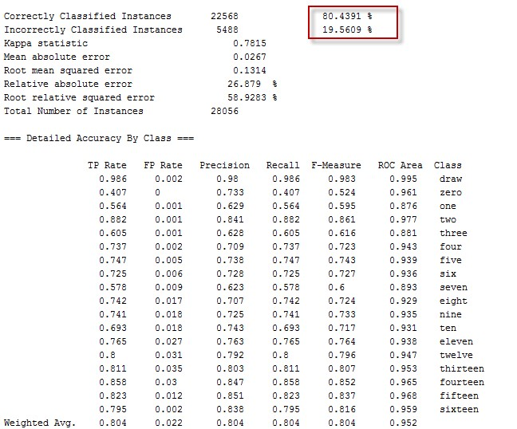
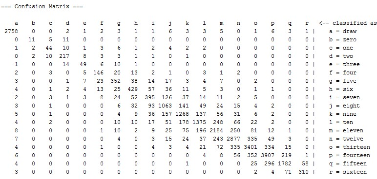

### Inomjon Ramatov(Curriculum Vitae, September 20, 2018)

#### Brief Bio  

 
Inomjon Ramatov earned his Bachelor degrees in computer science from Samarkand Branch of Tashkent University of Information Technologies (Uzbekistan, Samarkand) in July 2016. Currently, he is a Master student in School of Computer Science, Yangtze University, Jingzhou, Hubei, China. His main research interests focus on: Computer vision via Deep Learning algorithms. 
 His objective is utilize his skills in problem solving, Machine Learning,Computer Vision, and Deep Learning. 

#### Education
* 
Yangtze University  

   <i>Master degree. Computer Science. </i>
   - Advisors: Prof. Qin Han, Dr. Wei Zhan
   -  Research on: Object detection from the video taken by drone via Convolutional neural networks
   - Emphasis: Computer Vision, Object Detection, Digital Image processing and recognition, Convolutional Neural Networks.

  

  Hubei, Jingzhou, China
    Sep.2016, Expected July.2019
  

*  
Samarkand Branch of Tashkent University of Information Technologies 

     <i>Bachelor degree., Computer science and IT </i>
     - Advisors: As. Prof. Muradov Farrukh, Shekhroz Khudayarov
     -  Final Qualifying Work: Creating software for mobile phones teaching physics educational(in English)
     - Emphasis: Java programming and Working on Android Studio
     - Graduated with Honors
     
 Uzbekistan, Samarkand 

     
 Sep.2012-July.2016 

#### Research Interests
* Computer Vision for big Image Data via Deep Learning Algorithm;
* Android Application Development using Java programming language.

#### Programming Languages
Worked in
* Python
* Java
* C++
* Django, python based framework
* HTML and CSS

#### Software Tools
* Android Studio;
* Anaconda;
* CodeBlocks;
* Eclipse;
* MS Visual Studio;
* PyCharm
* RAD Studio

#### Operating System Platforms
* Microsoft Windows (all releases);
* UNIX

#### Personal Skills
* Quick Learner;
* Working in a team;
* Communication Skills.

#### Languages

* English;
* Russian;
* basic Chinese;
* native Uzbek.

#### Activities and Interests
* Participated in ACM International Collegiate Programming Contest 2013-2014, NEERC;
* Participated in ACM International Collegiate Programming Contest 2015-2016, NEERC;
* Playing Football and Chess.

## The Research and It’s Application
**Object detection from the video taken by drone via Convolutional neural network**

 The aim of this research is to show the implementation of object detection on drone videos using TensorFlow object detection API. The functional problem of the research is the identification of people, trees, cars and buildings from the real-world video frames taken by drones. In the research explored how state-of-the-art object detection algorithms perform on image data from a drone. 

[Experiment result on YouTube](https://www.youtube.com/watch?v=Ym5aURaypu0&feature=youtu.be "Object detection from the video taken by drone via Convolutional neural network")

## Experiments:
**Image classification via CNN.**

Aim of this experiment was learn Keras-high level Neural Network library and Transfer learning.

**Real time face detection and face recognition using FaceNet- deep CNN.**

Aim of this experiment was learn Face detection and recognition using deep convolutional neural networks.

## Courseworks:

**Data Mining Course project :King-Rook versus King Chess Endgame Database.**

 
 Basing our analysis on interesting works using KRK patterns, we have developed a knowledge consisting in 16 attributes. Thus we were able to transform the primary database in a bunch of new ones by using different attribute sets. Thanks to Data Mining decision trees, we could then save the new databases very optimally, obtaining in the best case a compression 3 times better than standard compression methods.

 
 

## Android Applications

Link to all applications on Google play store: [here](https://play.google.com/store/apps/developer?id=Inomjon)

