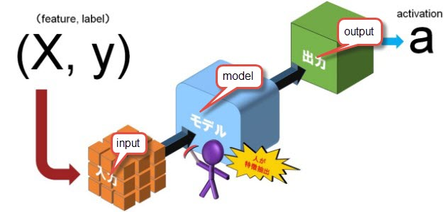

---

title: "Hello World"
date: 2021-01-08
tags: [Qiziq]
header:
   image:"/images/ml-p1/ml-p1-background.jpeg"

excerpt: "Assalomu alaykum!"

---

# Machine Learning part 1: Machine learning o'zi nima?

Assalomu alaykum qadrli do’stlar! O’ylashimcha, bu maqolani o’qiyotgan ekansiz demak “Machine learning” haqida eshitgansiz, ayniqsa o’tgan 5 yil ichida bu atama juda ommobop mavzuga  aylandi. Agar sizda hali ham bu atama nimani anglatishi haqida ikkilanishlar bo’lsa bugun men sizlar bilan bu haqadagi o’z  tushunchalarimni baham ko’rmoqchiman.
Demak boshladik, sizni bu yerga yetaklab kelgan eng muhim savol yoki sabab: ““Machine learning” o’zi nima?”  degan savolga javob topish. Fikrimcha siz mendan darsliklarda yoki Wikipediada yozilgan uzundan uzun , tushunarsiz tariflarni eshitmoqchi emassiz. Sodda qilib aytadigan bo’lsam “Machine learning” bu- biz endilikda kompyuterlarga qanday ishlashni o’rgatmaymiz, biz shunday qilamizki kompyuterlar nimadir qilishni o’zlari o’rganadi!
Haliyam tushunarsizmi?! Keling rasm orqali tushunishga harakat qilamiz: 

Rasmda ko’rganingizdek, bizda model (o’rtada eng katta ko’k quti), kiruvchi ma’lumot (birinchi quti) qaysiki attribute va labellardan iborat (feature and label) va chiquvchi ma’lumot (activation) bor. Bular o’zi nima demoqchimisiz?
Tassavur qiling, siz kompyuteringiz sizga berilgan rasmda it bor yoki yo’qligini aytib bera olishini xoxlaysiz. Demak bizda it rasmi bor:

